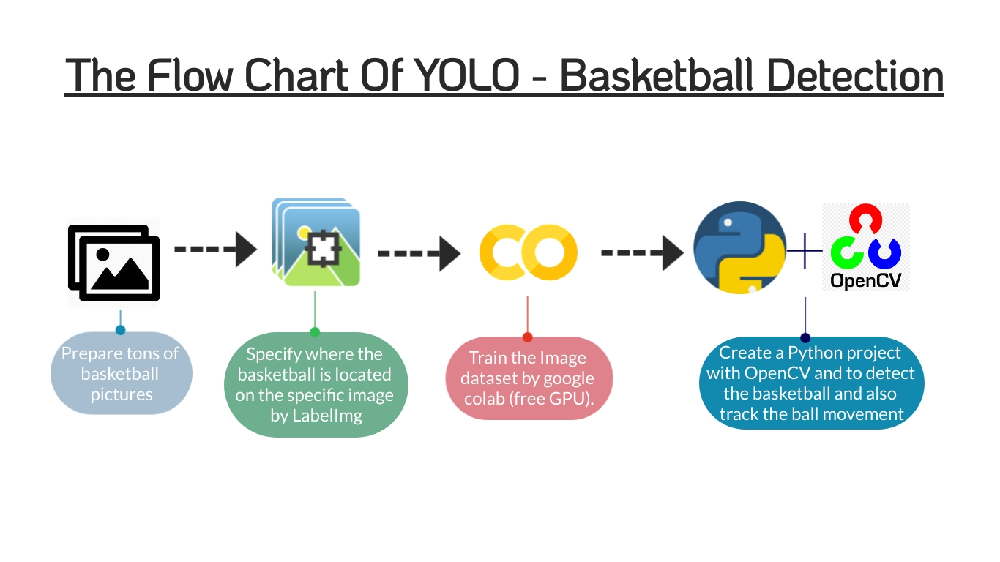
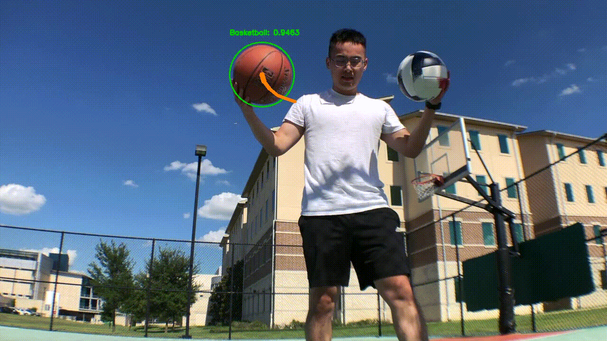

# Deep Learning YOLO - Basketball Detection

__Motivation__:\
As both basketball and machine learning enthusiast, I really want to combine these two elements in a project.\
Therefore, I used the YOLO algorithm to detect the basketball in a video and track the ball as it moves around in the video frames, drawing its previous positions as it moves. (you can see the result below)

In this project, I used Python, OpenCV, Google Colab, and LabelImg.

The project's flow chart
---

## Important Resourses
This is my first deep learning project. And as we all know, Deep learning is a complicated field and as a novice like me, it's impossible to finish this project without research and tutorials. Therefore, I want to give a big big thanks to below resources I used. This project cannot be done without them!/
Highly recommended if you are new in deep learning.

### The References and Tutorials I used
1. [Train YOLO to detect a custom object](https://pysource.com/2020/04/02/train-yolo-to-detect-a-custom-object-online-with-free-gpu/)
2. [YOLO object detection with OpenCV](https://www.pyimagesearch.com/2018/11/12/yolo-object-detection-with-opencv/)
3. [Ball Tracking with OpenCV](https://www.pyimagesearch.com/2015/09/14/ball-tracking-with-opencv/)

__Step 1. Prepare the training pictures__\
Most machine learning start from collecting data. There is no shortcut.\
This step is boring and time-consuming. However, it is important. I redo this step several times.\
There are two reasons.\
First, I used to build a model based on only 100 pictures. But the detecting result was wretched.\
Second, the picture you choose needs to in the various forms. Take my case, for example, my image dataset needs to contain a basketball in a crowd, a basketball in a regular court, a basketball with the sunset, etc... We must provide abundant examples for a machine to learn. In my final dataset, I acquired 309 pictures. It was the most tiring thing in the project.

__Step 2. Specify the basketball in the image with LabelImg__\
After I collected the data, I need to specify where is the basketball in the image. I used LabelImg to do this. You need to label all the pictures in your dataset. 
\
(I did this for 309 times....)

__Step 3. Train the image datasets by google colab__\
The fun part beginning! Time to train our dataset.\
The reason why I used google colab is that it provides free GPU. Training the YOLO algorithm requires heavy computation and using GPU can make this process faster.\
In a nutshell, I upload the dataset to google drive and connected it to the Jupyter notebook in Colab. Training the dataset by darknet.\
If you want to learn more, you can click the tutorial I followed (below link).
[Train YOLO to detect a custom object](https://pysource.com/2020/04/02/train-yolo-to-detect-a-custom-object-online-with-free-gpu/)

The reason why I used the YOLO is that the YOLO is based on regression. It can scan the whole image and make predictions to localize, identify, and classify objects within the image. It is much faster than CNN which is based on classification.\
If you want to use for real-time object detection, YOLO is a good choice.

__Step 4. Create Python project to implement the model__\
Final step! I used the model I trained to detect the basketball in the video.\
And after I located the ball I circled it based on the center and the radius. And stored the previous ball's center in a list. Therefore, I can use the list to draw a tracking line on the video.\
You can find my Python file in the repositories.

